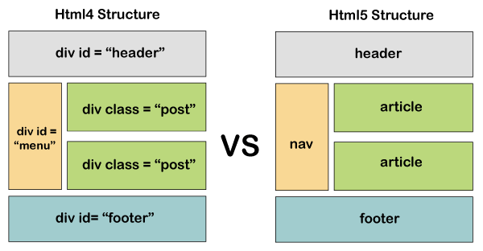
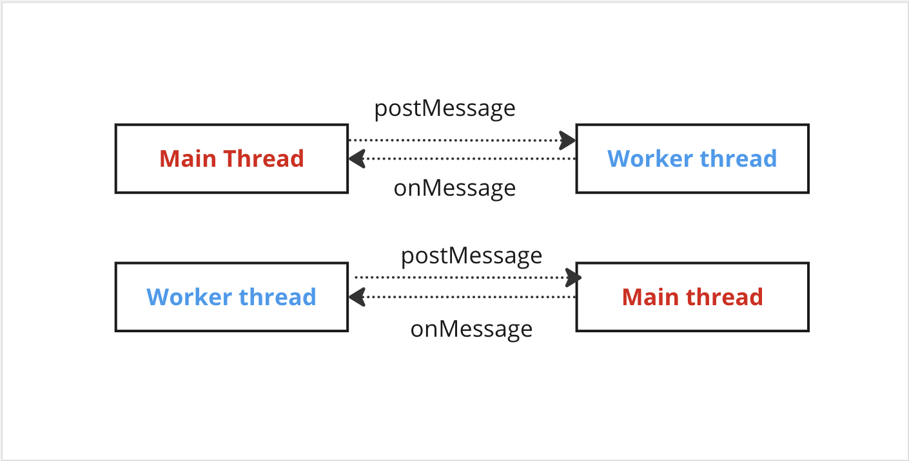

### HTML5

**HTML5 Tags**

HTML 5 introduced the new semantic tags like `<header>`, `<footer>`, `<nav>`, `<article>`, `<section>`, `<aside>`, `<main>`, etc.
Before HTML5 , the code structure would look something like this (full of divs)



```html
<div id="main">
  <div id="header">Header</div>
  <div class="section">
    <div id="menu">Nav</div>
    <div id="posts">Posts</div>
  </div>
  <div id="footer">Footer</div>
</div>
```

```html

<main>
    <header>Header</header>
    <section>
        <nav>Nav</nav>
        <article>Posts<article>
    </section>
    <footer>Footer</footer>
</div>

```

<!-- <iframe src="https://stackblitz.com/edit/js-tx1wbq?embed=1" height="500" width="500"></iframe> -->

The tags are used to promote the firstly the readability of the HTML code.
The tag also helps to increase the accessibility of your website as the screen readers and other devices can easily identify different sections of the website from html tags only.

**Audio Vido Tag**

Audio and Video tags are the two major addition to HTML5. It allows developers to embed a video or audio on their website.

```html
<video width="300" height="200" controls autoplay>
  <source src="/html5/foo.ogg" type="video/ogg" />
  <source src="/html5/foo.mp4" type="video/mp4" />
  Your browser does not support the video element.
</video>

<audio controls autoplay>
  <source src="/html5/audio.ogg" type="audio/ogg" />
  <source src="/html5/audio.wav" type="audio/wav" />
  Your browser does not support the audio element.
</audio>
```

**Vector graphics (Svg)**

```html
<svg id="svgelem" height="200" xmlns="http://www.abc.org/2000/svg">
  <circle id="redcircle" cx="50" cy="50" r="50" fill="red" />
</svg>
```

**Form attributes**

- placeholder
- input type **email**

```html
<form>
  Email:
  <input
    type="email"
    value="manaschhabra499@gmailo.com"
    placeholder="Type your email"
  />
</form>
```

---

### HTML5 APIs

HTML5 also introduced a lot of new apis to provide new functionalities for developing applications for web. This was the thing which accelerated the growth of JS in last decade. A lot of new frameworks were able to build for web. And web application became the first choice of all companies for making new applications.

**GeoLocation API**

The Geolocation API is used to get the current location of the user or the page visitor. User needs to allow the access to its location.

```js
function calculatePosition() {
  let pos = navigator.geolocation;
  pos.getCurrentPosition((location) => {
    const { latitude, longitude } = loc.coords;
    console.log("Longitude:", latitude);
    console.log("Longitude:", longitude);
  });
}
```

**Drag and Drop API**

**Web Storage**

Before Web Storage API, web data was stored in cookies.

_Cons_

- Limited Storage
- Data stored in cookies used to travel along with every network call to server, making calls heavy.

**Session Storage**

- Stores data only for a session, meaning that the data is stored until the browser (or tab) is closed.
- Data persists over multiple page reloads or restores.
- Opening multiple tabs/windows with the same URL creates sessionStorage for each tab/window.
- Data is never transferred to the server.
- Storage limit is larger than a cookie (at most 5MB)

```js
// Save data to sessionStorage
sessionStorage.setItem("key", "value");

// Get saved data from sessionStorage
let data = sessionStorage.getItem("key");

// Remove saved data from sessionStorage
sessionStorage.removeItem("key");

// Remove all saved data from sessionStorage
sessionStorage.clear();
```

**Local Storage**

- Data persists even when the browser is closed and reopened.
- Data and gets cleared only through JavaScript, or clearing the Browser cache / Locally Stored Data.

```js
// Save data to localStorage
localStorage.setItem("myCat", "Tom");

// Get saved data from localStorage
const cat = localStorage.getItem("myCat");

// Remove saved data from localStorage
localStorage.removeItem("myCat");

// Remove all saved data from localStorage
localStorage.clear();
```

**Web Workers**

Web Worker is simply a javascript process that runs in the background of a webpage.
Javascript is a single threaded language which executes the web page line by line.
To offload some of its work, heavy calculations can be offloaded to a parallel thread created by web worker. This way we can ensure main thread is not blocked.

- Web worker can't perform any DOM manipulation



_Coding Demo_

---

```javascript
console.log("hello");
```
