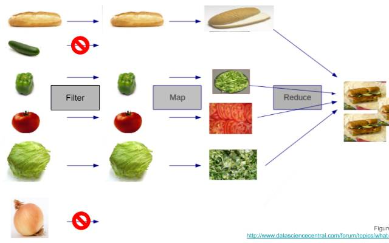

### Strings

Useful Methods:

- split()
- toLowerCase()
- substring()
- startsWith()

### Data structures in Javascript

- Array
- Object
- Set
- Map

### Arrays

Useful Methods

- Array.from()
- .isArray()
- .reduce()
- .map()
- .push()
- .pop()
- .join()
- .filter()

#### Filter,Map,Reduce



**Array.filter**

It creates a new array containing all elements of the original array that satisfy a specified testing function

**Syntax**

```js
let newArray = arr.filter(callbackFn(element, index, array));
```

**Example**

```js
const numbers = [1, 2, 3, 4, 5, 6, 7];

const oddNumbers = numbers.filter(function (number) {
  return number % 2 !== 0;
});

console.log(oddNumbers); // Output: [1, 3, 5, 7]
```

---

**Array.map**

- Always returns a new array
- used to transform elements in exisiting array

**Syntax**

```js
let newArray = arr.map(callbackFn(element, index, array));
```

**Example**

```js
const arr = [1, 2, 3];
// we want to transform every value to be double

const newArr = arr.map((item) => item * 2);

console.log(newArr);
// [2,4,6]
```

---

**Array.reduce**

- return single value
- accumulates array values based on callback function

**Syntax**

```js
const result = array.reduce(
  callback(accumulator, currentValue, currentIndex, array),
  initialValue
);
```

**Example**

```js
const numbers = [1, 2, 3, 4, 5];

const sum = numbers.reduce(function (accumulator, currentValue) {
  return accumulator + currentValue;
}, 0);

console.log(sum); // Output: 15
```
