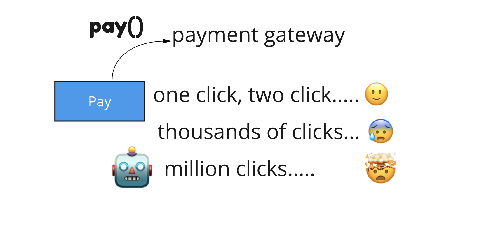
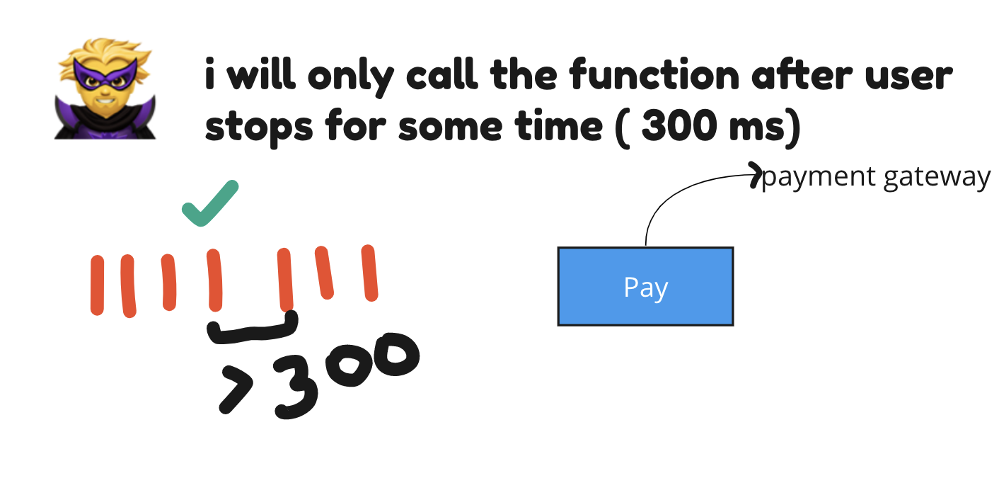
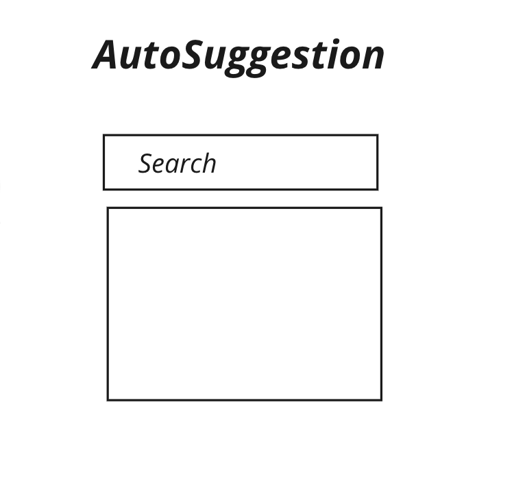
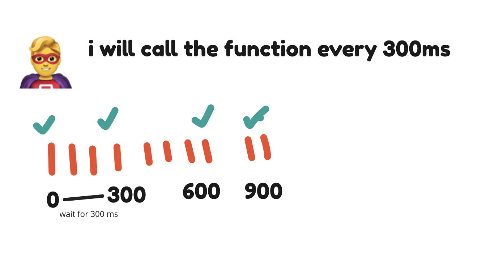
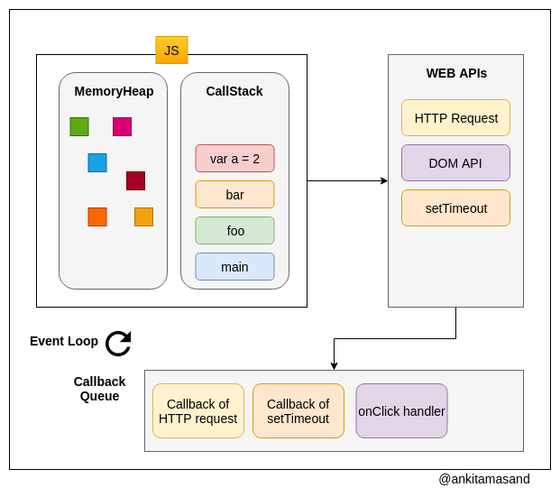

### JS Concepts

#### Currying

Transforms function callable from
f(a,b,c) -> f(a)(b)(c)

```js
function sum(a, b, c) {
  return a + b + c;
}

console.log(sum(1, 2, 3)); // 6
```

Curried function

```js
// usage sum(1)(2)(3) -> 6

function sum(a) {
  return function (b) {
    return function (c) {
      return a + b + c;
    };
  };
}
```

---

### Debounce & Throttle

Debounce and throttle both are performace
optimisation techniques. It basically controls how many times your functions get executed

**Debounce**





---

**Throttle**




---

### Event Loop

```js
var a = 2;
function foo() {
  console.log("foo");
}
function bar() {
  setTimeout(() => {
    console.log("bar");
  }, 0);
}

bar();
foo();
fetch("/users").then(displayUsers);
```



- SetTimeout callback goes into callback queue
- Promises are sent to microtask queue
